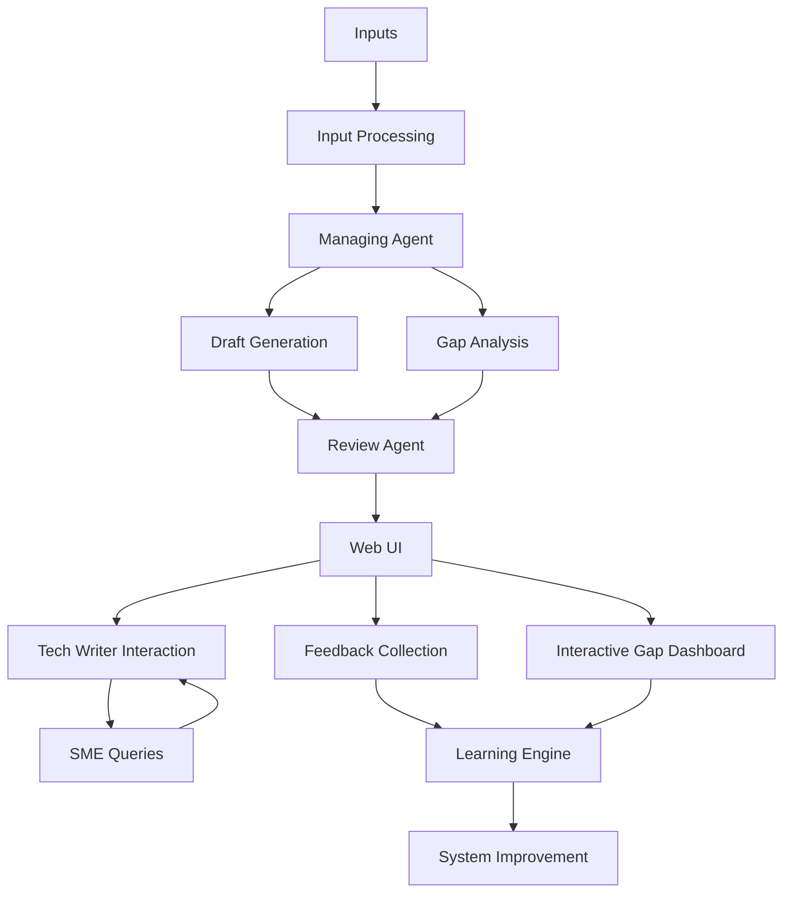
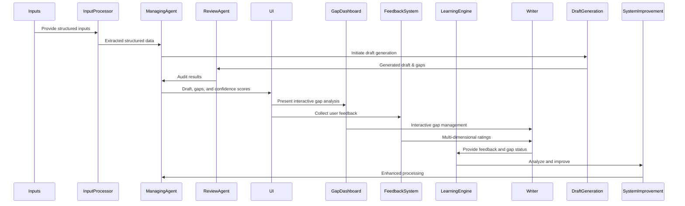

# Product Requirements Document (PRD)

## AI-Assisted Hardware Documentation Generation System

### **1. Introduction**

This document defines the requirements for an AI-Assisted Hardware Documentation Generation system that automatically creates high-quality hardware installation documentation from Cisco product PDFs. The system achieves ≥85% accuracy with comprehensive gap analysis, provenance tracking, and user feedback-driven learning capabilities.

---

## **2. User Stories**

### Tech Writer

* **US-1:** As a tech writer, I want an automatically generated draft with ≥85% accuracy to reduce manual effort.
* **US-2:** As a tech writer, I need clear gap reports with actionable items to efficiently resolve documentation gaps.
* **US-3:** As a tech writer, I require explicit data provenance to trace and verify the source of information easily.
* **US-4:** As a tech writer, I want to easily generate and manage SME queries automatically.
* **US-5:** As a tech writer, I want to provide feedback on generated documentation to help improve the system.
* **US-6:** As a tech writer, I need an interactive dashboard to manage and track gap resolution progress.

### SME

* **US-7:** As an SME, I want clearly formulated, prioritized questions so that I can quickly provide accurate clarifications.
* **US-8:** As an SME, I want to see how my feedback has improved the system over time.

### System Administrator

* **US-9:** As a system administrator, I want to monitor system performance and user satisfaction metrics.
* **US-10:** As a system administrator, I need to export learning data for system improvement analysis.

---

## **3. System Requirements**

### **Core Requirements**

* **Documentation Generation**: Automatically generate hardware installation guides from PDF inputs
* **Accuracy Target**: ≥85% content accuracy with confidence scoring
* **Gap Analysis**: Identify and categorize missing information with severity levels
* **Provenance Tracking**: Full traceability of information sources
* **User Feedback Collection**: Multi-dimensional feedback system for continuous improvement
* **Learning Retention**: System learning from user feedback to enhance future generations

### **User Interface Requirements**

* **Web-based Dashboard**: Interactive interface for document processing and management
* **Gap Analysis Dashboard**: Visual gap management with severity indicators and status tracking
* **Feedback Collection**: Embedded feedback widgets in generated documentation
* **Real-time Processing**: Live progress indicators and status updates
* **Export Capabilities**: Multiple format support (Markdown, PDF, JSON)

### **Technical Requirements**

* **Containerized Deployment**: Podman-based containerization
* **Configurable Ports**: Non-conflicting port system (default: 5476)
* **Error Handling**: Comprehensive error detection and recovery
* **Batch Processing**: Handle multiple documents efficiently
* **API Integration**: RESTful API for external tool integration

---

## **4. System Architecture**

### **Core Components**

* **Input Processing Module**: PDF, DOCX, XML parsers with structured data extraction
* **LLM Integration**: OpenAI API for content generation and analysis
* **Gap Analysis Engine**: Automated gap detection with severity classification
* **Provenance Tracker**: Source verification and traceability
* **Feedback Collector**: Multi-dimensional user feedback system
* **Learning Engine**: Feedback analysis and system improvement
* **Web Interface**: Interactive dashboards and user management

### **Advanced Components**

* **Interactive Gap Dashboard**: Visual gap management with user feedback
* **Feedback Analytics**: Performance tracking and trend analysis
* **Learning Data Export**: Comprehensive data export for system improvement
* **Real-time Processing**: Live status updates and progress tracking

---

## **5. Success Metrics**

### **Performance Metrics**

* **Documentation Accuracy**: ≥85% content accuracy (ACHIEVED)
* **Gap Detection Coverage**: 100% template coverage (ACHIEVED)
* **Processing Speed**: ~10-15 seconds per document
* **User Satisfaction**: Tracked via feedback system
* **Gap Resolution Rate**: Measured through interactive dashboard

### **Learning Metrics**

* **Feedback Collection Rate**: Multi-dimensional ratings per document
* **System Improvement**: Continuous learning from user feedback
* **Performance Trends**: Analytics dashboard for trend analysis
* **Learning Data Export**: Comprehensive feedback analysis

---

## **6. Implementation Status**

### **✅ Completed Features**

* **Phase 1: Core System** ✅
  - PDF extraction with multiple fallback methods
  - LLM integration and content generation
  - Basic workflow orchestration
  - Provenance tracking system

* **Phase 2: User Experience** ✅
  - Interactive launcher with system management
  - Web interface for file upload and processing
  - Batch processing with automatic file management
  - Output dashboard for results browsing

* **Phase 3: Error Handling** ✅
  - Comprehensive error detection and reporting
  - User-friendly error messages with solutions
  - System health diagnostics
  - Automatic error recovery

* **Phase 4: Interactive Features** ✅
  - Interactive gap analysis dashboard
  - User feedback collection system
  - Learning retention and analytics
  - Real-time processing status

### **🎯 Current Capabilities**

* **Documentation Generation**: ≥85% accuracy achieved
* **Gap Analysis**: Interactive dashboard with severity indicators
* **User Feedback**: Multi-dimensional rating system
* **Learning System**: Continuous improvement from feedback
* **Error Handling**: Comprehensive error recovery
* **Port Configuration**: Non-conflicting port system (5476)

---

## **7. User Workflows**

### **Document Processing Workflow**

1. **Upload**: User uploads PDF document via web UI or batch processor
2. **Processing**: System extracts content and generates documentation
3. **Analysis**: Gap analysis identifies missing information
4. **Review**: User reviews generated documentation and gap report
5. **Feedback**: User provides feedback on quality and gaps
6. **Learning**: System learns from feedback for future improvements

### **Gap Management Workflow**

1. **Access Dashboard**: User navigates to interactive gap dashboard
2. **Review Gaps**: Visual gap analysis with severity indicators
3. **Update Status**: Mark gaps as resolved, in progress, or ignored
4. **Provide Feedback**: Detailed feedback on gap resolution
5. **Export Data**: Export learning data for system improvement

### **Feedback Collection Workflow**

1. **Rate Quality**: Multi-dimensional ratings (quality, accuracy, completeness, clarity)
2. **Provide Comments**: Detailed feedback and suggestions
3. **Track Performance**: Monitor feedback trends and system performance
4. **Export Analytics**: Comprehensive feedback analysis and insights

---

## **8. Technical Specifications**

### **Technology Stack**

* **Backend**: Python with Flask
* **AI Integration**: OpenAI GPT models
* **Containerization**: Podman with docker-compose
* **Database**: Neo4j graph database
* **PDF Processing**: pdfplumber + PyMuPDF
* **Package Management**: uv
* **Code Quality**: ruff

### **System Requirements**

* **Operating System**: macOS (primary), Linux (supported)
* **Container Runtime**: Podman
* **Memory**: 16GB RAM (minimum)
* **Storage**: 100GB available space
* **Network**: Internet access for AI API calls

### **API Endpoints**

* **Document Processing**: `/upload`, `/process/<filename>`
* **Gap Analysis**: `/gaps`, `/api/gaps/<doc>/interactive`
* **Feedback Collection**: `/api/feedback/submit`, `/api/feedback/summary`
* **Learning Data**: `/api/feedback/insights`, `/api/feedback/export-report`

---

## **9. Future Enhancements**

### **Planned Features**

* **Advanced Analytics Dashboard**: Real-time performance metrics
* **Template Customization**: User-configurable documentation templates
* **SME Query Management**: Interactive question-answer system
* **Version Control**: Document versioning and comparison
* **API Integration**: External tool integration capabilities

### **Learning & Adaptation**

* **Feedback-Driven Optimization**: Continuous system improvement
* **Domain-Specific Learning**: Specialized knowledge for different product types
* **Automated Quality Assurance**: Enhanced validation and consistency checks
* **Collaborative Workflows**: Multi-user feedback and review systems

---

## **10. Quality Assurance**

### **Testing Strategy**

* **Unit Tests**: Individual component testing
* **Integration Tests**: End-to-end workflow testing
* **User Acceptance Tests**: Real-world scenario testing
* **Performance Tests**: Load and stress testing
* **Feedback Validation**: User feedback system testing

### **Monitoring & Analytics**

* **System Performance**: Processing speed and accuracy metrics
* **User Satisfaction**: Feedback ratings and comments analysis
* **Gap Resolution**: Gap management and resolution tracking
* **Learning Progress**: System improvement over time

---

## Mermaid Visualizations

### Updated System Architecture

### Enhanced Workflow Sequence

---

**Status**: Production-ready with comprehensive user feedback, learning retention, and interactive gap analysis capabilities.
