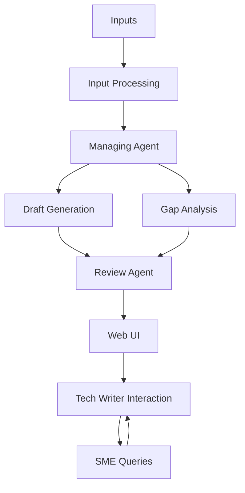
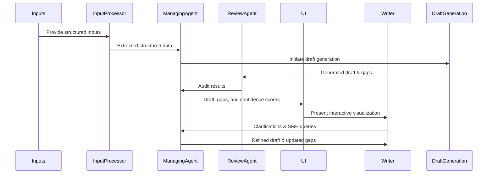

# Detailed Design Document and Phased Development Plan

## AI-Assisted Hardware Documentation Generation

### **1. Introduction**

This document outlines the detailed design and phased development plan to implement the AI-Assisted Hardware Documentation Generation system as defined in the PRD. This includes AI agent integration, automated gap analysis, provenance tracking, and minimal user interface for Cisco hardware installation documentation.

---

## **2. User Stories**

### Tech Writer

* **US-1:** As a tech writer, I want an automatically generated draft with ≥85% accuracy to reduce manual effort.
* **US-2:** As a tech writer, I need clear gap reports with actionable items to efficiently resolve documentation gaps.
* **US-3:** As a tech writer, I require explicit data provenance to trace and verify the source of information easily.
* **US-4:** As a tech writer, I want to easily generate and manage SME queries automatically.

### SME

* **US-5:** As an SME, I want clearly formulated, prioritized questions so that I can quickly provide accurate clarifications.

---

## **3. Detailed Architecture & Components**

### **System Components:**

* **Input Processing Module**:

  * Parsers (PDF, DOCX, XML)
  * Structured Data Extractor
* **LLM Agents**:

  * **Managing Agent:** Workflow control, gap detection, SME question management
  * **Review Agent:** Provenance and confidence audit
* **Gap Analysis & Confidence Module**
* **Draft Generation Module**
* **Provenance Tracking Module**
* **Minimal Web UI**:

  * Confidence visualization
  * Export functionality (Markdown/PDF)

### **Graph Database (Exploratory)**

* Evaluate integration of Neo4j or similar to manage long-term correlations across evolving product documentation.

---

## **4. Phased Development Plan**

### **Phase 1: Environment Setup & Input Processing**

* Set up local macOS environment.
* Containerize application using Podman.
* Integrate `uv` and `ruff`.
* Develop input parsers and structured data extractors.

**Deliverables:**

* Environment setup documentation
* Input ingestion scripts and tests

### **Phase 2: Managing and Review Agents Implementation**

* Develop Managing Agent for workflow orchestration, gap identification, and question generation.
* Implement Review Agent for provenance consistency audits.

**Deliverables:**

* Managing and Review Agent prototypes
* Provenance and gap analysis validation tests

### **Phase 3: Draft Generation and Gap Analysis Validation**

* Implement AI-driven draft generation.
* Validate gap analysis and confidence scoring accuracy.

**Deliverables:**

* Initial documentation drafts
* Gap and confidence score reports

### **Phase 4: Minimal User Interface Development**

* Create minimal web-based UI.
* Implement confidence visualization and interactive gap report.

**Deliverables:**

* Functional minimal UI
* Interactive gap report testing

---

## **5. Technical Stack**

* **Backend:** Python
* **AI Integration:** LLM APIs
* **Containerization:** Podman
* **Package Management:** `uv`
* **Code Quality:** `ruff`
* **Frontend:** Minimal React or similar lightweight JS framework
* **Graph DB (Exploratory):** Neo4j or similar

---

## **6. Testing and Quality Assurance**

* Unit tests for individual components (parsers, agents).
* Integration tests for end-to-end workflow.
* User acceptance tests with the tech writer.

---

## **7. Constraints & Assumptions**

* Inputs structured reasonably well.
* macOS environment with Podman.
* Internet access available for AI calls.

---

## **8. Success Metrics**

* Initial draft ≥85% accuracy.
* Provenance tracking accuracy: 100%
* User satisfaction via reduced gap analysis effort.

---

## **9. Future Enhancements**

* Advanced interactive dashboards.
* Deeper automation and iterative enhancement cycles.
* Integration with enterprise documentation management systems.
* Implement graph database for long-term data correlation.

---

## Mermaid Visualizations

### System Architecture

### Workflow Sequence

---
